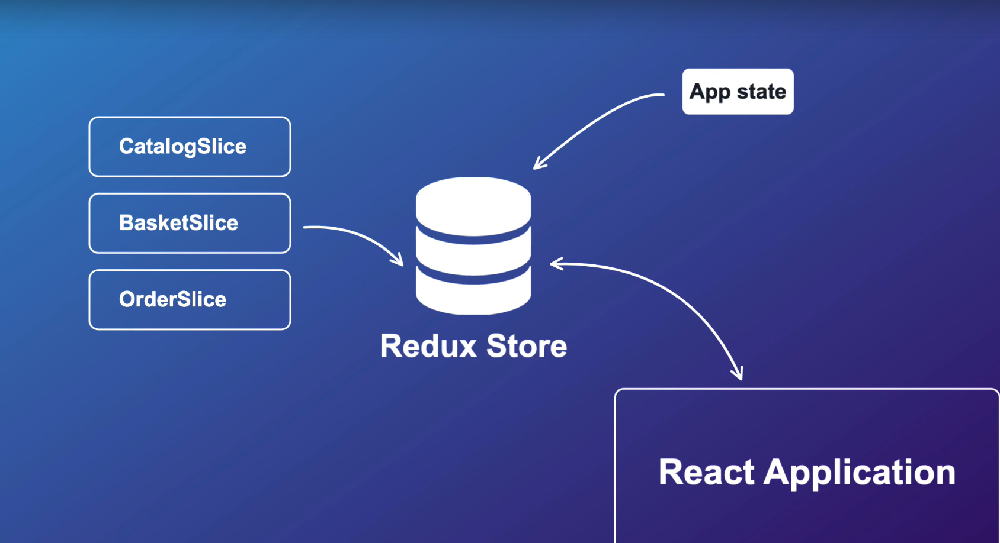
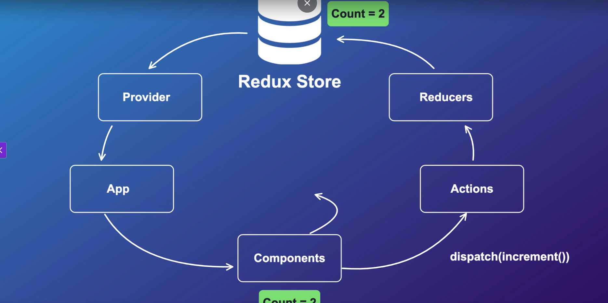
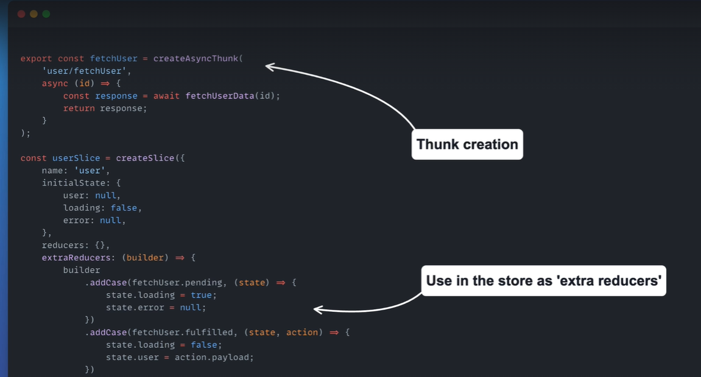
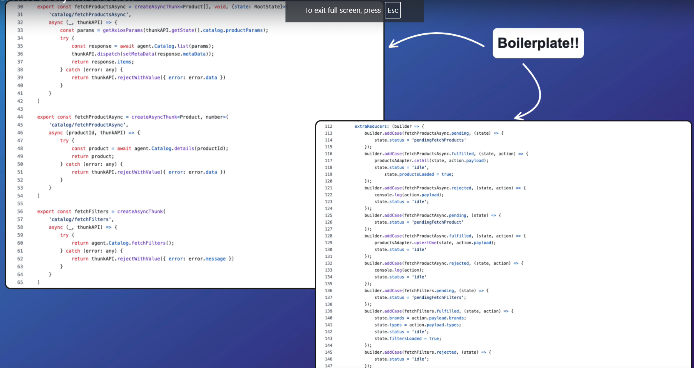
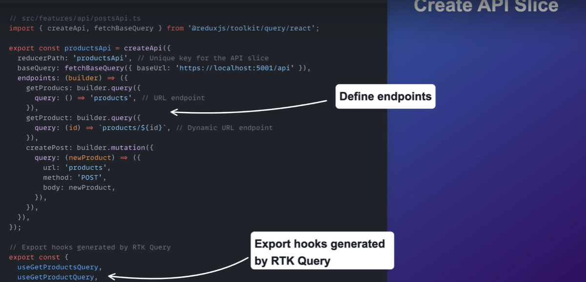

# ecom

## Tech Stack

- .Net 9.0
- React 19
- Angular 18

## Tools

- VSCode or Rider
- Postman
- Git
- [Node.js with NVM](https://joachim8675309.medium.com/installing-node-js-with-nvm-4dc469c977d9)

## VSCode Extensions

- C# Devkit [Microsoft]
- C# [Microsoft]
- sqlite [alexcvzz]
- Material Icon Theme [Philipp Kief]
- Nuget Gallery [pcislo]
- ES7+ React/Redux/React-Native snippets [dsznajder]
- ESLint [Microsoft]
- Angular Language Service [Angular]
- Tailwind CSS Intellisense [Tailwind]
- Auto Rename Tag [Jun Han]

## Fix for certificate issue when running

```
dotnet dev-certs https --clean
dotnet dev-certs https --trust
```

## Install Entity Framework tool

```
dotnet tool install --global dotnet-ef --version 9.0.0
dotnet tool list -g
```

## In order to send cookie with request make sure in `program.cs` file you should have `AllowCredentials()` set in `UseCors and make sure `AllowAnyOrigin`is replaced with`WithOrigins`

```#
pp.UseCors(options => options.WithOrigins("https://localhost:3000","https://localhost:4200").AllowAnyMethod().AllowCredentials().AllowAnyHeader());
```

---

# React

## Install certificate for react app using vite

```
npm i vite-plugin-mkcert -D
```

Edit the `vite.config` file and add this

```typescript
import { defineConfig } from "vite";
import react from "@vitejs/plugin-react-swc";
import mkcert from "vite-plugin-mkcert";

// https://vite.dev/config/
export default defineConfig({
  server: {
    port: 3000,
  },
  plugins: [react(), mkcert()],
});
```

## Convert Json To Typescript [Link](https://transform.tools/json-to-typescript)

## Installation of Material UI in react

```shell
npm install @mui/material@6 @emotion/react @emotion/styled
npm install @fontsource/roboto
npm install @mui/icons-material
```

Add this styles to `main.ts` file

```typescript
//main.ts
import "@fontsource/roboto/300.css";
import "@fontsource/roboto/400.css";
import "@fontsource/roboto/500.css";
import "@fontsource/roboto/700.css";
```

## Setup routing in react

Install this `react-router-dom`

```shell
npm i react-router-dom --legacy-peer-deps
```

Create a new file called `routes/Router.tsx` inside `app` folder

```

export const router = createBrowserRouter([
    {
        path: "/", // route route
        element:<App />, // specify app component here
        children: [
            { path: "", element: <HomePage /> }, // specify home component
            { path: "/catalog", element: <Catalog /> }, // specify catalog component
            { path: "/catalog/:id", element: <ProductDetails /> }, // specify product details component
            { path: "/about", element: <AboutPage /> }, // specify about component
            { path: "/contact", element: <ContactPage /> }, // specify contact component
        ]
    }
])

```

Now edit `main.tsx` file and add `RouterProvider`

```

createRoot(document.getElementById('root')!).render(
    <StrictMode>
        <RouterProvider router={router} />
</StrictMode>,
)

```

Now edit `app.tsx` file and replace it with `outlet`

```js
function App() {
    const [darkMode, setDarkMode] = useState(true);
    const palleteType = darkMode ? 'dark' : 'light';
    const darkTheme = createTheme({
        palette: {
            mode: palleteType,
            background: {
                default:(palleteType === "dark") ? "#eaeaea" : "#121212",
            }
        },
    });

    return (
        <>
            <ThemeProvider theme={darkTheme}>
        <CssBaseline />
        <NavBar darkMode={darkMode} toggleDarkMode={()=> setDarkMode(!darkMode)}></NavBar>
    <Box sx={{minHeight: '100vh',
        backgroundColor: (darkMode ?  '#121212':'#eaeaea' ), py:6}}>
    <Container maxWidth="xl" sx={{mt:8}}>
    <Outlet /> <!-- Replaced catalog with outlet component-->
    </Container>
    </Box>
    </ThemeProvider>
    </>
)
}

export default App
```

Now in your `navbar` component create this list and use it with 'NavLink'

```js
const midLinks = [
    { title: "catalog", path: "/catalog" },
    { title: "about", path: "/about" },
    { title: "contact", path: "/contact" },
];

const rightLinks = [
    { title: "login", path: "/login" },
    { title: "register", path: "/register" },
];

const NavBar = ({ darkMode, toggleDarkMode}: Props) => {

    return (
        <>
            ...
            ...
              <List sx={{display: "flex"}}>
                    {midLinks.map(({ title, path}) => (
                        <ListItem sx={{color:'inherit', typography:'h6'}} component={NavLink} to={path} key={path}>{title.toUpperCase()}</ListItem>
                    ))}

        </>
    )
}

...
```

First add this to your `router.tsx` file

```js
{ path: "/server-error", element: <ServerError /> }, // specify contact component
```

Now in the `errorApi.tsx` file add this to navigate to errors page

```js
//To navigate to different page and pass data
router.navigate("/server-error", {
  state:{
    error: <your error object>
  }
});

```

In `ServerError.tsx` file you can retrieve state data this way:

```js
const { state } = useLocation();
```

## Store for Global Statemanagement

- What is redux?

- Redux is a synchronous store
- Its like a in memory database stored on client and removes props drilling

  

- It provides some hooks like `useSelector(state => state.counter.value)` for displaying/reading value and `useDispatch(increment())` for updating the state without mutating (changing) the old state and creating a new state which will update the value and cause react to rerender the UI
- Redux flow

  

- Reducer is a function that takes current statem and action and then returns the new state

- Best Practices for Redux
  - Donot mutate state (ie clone it and update that new state)
  - Reducers must not have side effects like calling API
  - Donot have non serializable values in state or actions
  - 1 Store per app

## Setup

- Installation

```shell
npm i @reduxjs/toolkit
npm i react-redux
```

## Cleaner way and optimize way to use useSelector and useDispatch with types

Click on this [link](https://redux.js.org/tutorials/typescript-quick-start#define-typed-hooks)

## Redux Thunk

- Its a function that is returned by another function and be executed later.
- In redux, thunk allows action creators to return function instead of plain object.

  

  

## RTQ Query (replacement for Redux Thunk)

- Reduced boilerplate when compared to thunk
- Builtin data fetching
- Typescript support
- Optimistic updates
- Automatic caching
- Server state focused
- Built in middleware



## Install react-toastify for tost notification

Installation

```shell
npm i react-toastify
```

Setup toast provider in `main.ts` file

```js
import "react-toastify/dist/ReactToastify.css";

createRoot(document.getElementById('root')!).render(
        <StrictMode>
          <Provider store={store}>
            <ToastContainer position="bottom-right" hideProgressBar theme="colored"></ToastContainer>
            <RouterProvider router={routes} />
          </Provider>
        </StrictMode>,
)

```

## If you are using axios for making api call this is how you can use interceptors for configuring different error

(Axios Interceptors)[https://github.com/TryCatchLearn/Restore/blob/main/client/src/app/api/agent.ts]

## If you want to include cookies in react client in React Query make sure to inculde `credentials:"include"` in `baseQueyApi`

```js
const customBaseQuery = fetchBaseQuery({
  baseUrl: "https://localhost:5001/api",
  credentials: "include",
});
```

# 🛒 Basket API with RTK Query (How to deactivate Caching simple way)

## 📁 File: `basketApi.ts`

```ts
export const basketApi = createApi({
  reducerPath: "basketApi",
  baseQuery: baseQueryWithErrorHandling,
  tagTypes: ["Basket"], // 👈 Tag type used for cache management
  endpoints: (builder) => ({
    fetchBasket: builder.query<Basket, void>({
      query: () => ({ url: "basket" }),
      providesTags: ["Basket"], // 👈 Caches this query result with tag "Basket"
    }),
    addBasketItem: builder.mutation<
      Basket,
      { productId: number; quantity: number }
    >({
      query: ({ productId, quantity }) => ({
        url: `basket?productId=${productId}&&quantity=${quantity}`,
        method: "POST",
      }),
      onQueryStarted: async (_, { dispatch, queryFulfilled }) => {
        try {
          await queryFulfilled;
          dispatch(basketApi.util.invalidateTags(["Basket"])); // 👈 Triggers refetch of fetchBasket
        } catch (error) {
          console.error(error);
        }
      },
    }),
    removeBasketItem: builder.mutation<
      void,
      { productId: number; quantity: number }
    >({
      query: ({ productId, quantity }) => ({
        url: `basket?productId=${productId}&&quantity=${quantity}`,
        method: "DELETE",
      }),
      invalidatesTags: ["Basket"], // 👈 Automatically refetches queries tagged with "Basket"
    }),
  }),
});
```

## 🧠 Explanation

### 🔖 `tagTypes`

```ts
tagTypes: ["Basket"];
```

Defines the logical tag used to identify cached data. This must be registered at the root of the API.

### 🏷️ `providesTags`

```ts
providesTags: ["Basket"];
```

Used on **queries** to label their cached data with the specified tag (`'Basket'`).

### ❌ `invalidateTags`

```ts
invalidateTags: ["Basket"];
```

Used on **mutations** to notify RTK Query that any data previously tagged with `'Basket'` should be re-fetched.

Alternatively, for advanced scenarios, you can use `onQueryStarted` to call:

```ts
dispatch(basketApi.util.invalidateTags(["Basket"]));
```

## ✅ Example Flow

1. `fetchBasket` runs and caches the response with tag `'Basket'`.
2. `addBasketItem` succeeds and invalidates `'Basket'`.
3. RTK Query automatically re-runs `fetchBasket` to get updated data.

# 🛒 Optimistic Update in RTK Query — `addBasketItem` Example

This document explains how the `addBasketItem` mutation uses an **optimistic update** strategy in a Redux Toolkit Query setup for a shopping basket.


## 📌 What is an Optimistic Update?

An **optimistic update** updates the UI **before** the server confirms the change. If the server request fails, the UI state is **rolled back**.

✅ Pros: Faster and smoother user experience.  
❌ Cons: Requires rollback handling in case of failure.


## 🔧 Mutation Definition

```ts
addBasketItem: builder.mutation<Basket, { product: Product, quantity: number }>({{
  query: ({ product, quantity }) => ({
    url: `basket?productId=${product.id}&&quantity=${quantity}`,
    method: "POST",
  }),
  onQueryStarted: async ({ product, quantity }, { dispatch, queryFulfilled }) => {
    const patchResult = dispatch(
      basketApi.util.updateQueryData("fetchBasket", undefined, (draft) => {
        const existingItem = draft.items.find(item => item.productId === product.id);
        if (existingItem) {
          existingItem.quantity += quantity;
        } else {
          draft.items.push(new Item(product, quantity));
        }
      })
    );

    try {
      await queryFulfilled;
      dispatch(basketApi.util.invalidateTags(["Basket"]));
    } catch (error) {
      console.log(error);
      patchResult.undo();
    }
  }
})
```


## 🧠 Step-by-Step Explanation

### 1. 🖌️ Optimistically Update the UI

```ts
basketApi.util.updateQueryData("fetchBasket", undefined, (draft) => {
  // Modify cached data immediately
})
```

- Updates the local cache before waiting for server confirmation.
- Creates a more responsive experience for the user.

### 2. ⏳ Await Real Server Response

```ts
await queryFulfilled;
```

- Waits for the actual result of the POST request.

### 3. ♻️ Invalidate Tag (Optional)

```ts
dispatch(basketApi.util.invalidateTags(["Basket"]));
```

- Ensures that the data is refetched if needed (optional for extra safety).

### 4. ❌ Rollback on Error

```ts
patchResult.undo();
```

- If the server call fails, this reverts the UI to its previous state.

---

# Angular

## Installation of angular

This [link](https://angular.dev/reference/versions) tell which node is compatible with angular

```shell
npm install -g @angular/cli
```

If you get error like this `Error: error:0308010C:digital envelope routines::unsupported` while running `ng serve` add this environment variable

```shell
export NODE_OPTIONS="--openssl-legacy-provider"
```

If you are not able to update your angular cli

```shell
npm uninstall -g @angular/cli
npm cache clean --force
npm install -g @angular/cli@18.1.2
```

## Configured `https` for angular

- [Install mkcert](https://github.com/FiloSottile/mkcert)
- Run this command in terminal `mkcert -install`
- Inside project folder create a new folder `ssl` and run this command `mkcert localhost`
- Edit `angular.json` file and add following code

```js
"serve": {
          "builder": "@angular-devkit/build-angular:dev-server",
          "options": {
            "ssl": true,
            "sslCert": "ssl/localhost.pem",
            "sslKey": "ssl/localhost-key.pem"
          }
```

## Install Angular Material

```shell
ng add @angular/material
```

## Install TailwindCss in angular

```shell
npm install -D tailwindcss postcss
npx tailwindcss init
```

Edit `tailwind.config.js`

```js
/** @type {import('tailwindcss').Config} */
export default {
  content: ["./src/**/*.{html,ts}"],
  theme: {
    extend: {},
  },
  plugins: [],
};
```

Now open you global `.css` file and add this

```css
@tailwind base;
@tailwind components;
@tailwind utilities;
```

## Useful commands for angular

To generate a component

```shell
ng g c layout/header --skip-tests --dry-run
ng g c layout/header --skip-tests
```

To generate a service

```shell
ng g s core/services/shop --skip-tests --dry-run
ng g s core/services/shops --skip-tests
```

## How to pass data to different component in angular similar to react `props`

In your component file say for example `product-item.component.ts` declare this variable

```js
@Input() product?: Product;
```

And you can use this in the component like this

```js
 <app-product-item [product]="product"></app-product-item>
```

## `Observables` vs `Promises`?

### Observables

- A sequence of items that arrive asynchronously over time like API or Http request
- They are more powerful that `promises`
- Are cancellable
- Stream data in multiple pipelines
- Array like operations
- Can be created from other sources like events
- They can be subscribed to
- Observables -> 1 cancel and (2 fail or succeed -> subscribe -> map -> filter -> data)

### Promises

- Has one pipeline
- Typically used with async data return
- Not easy to cancel
- Promises -> then -> 1 success and 2 fail

### Http, Observables and RxJS working

- Http get request from shopservice
- Receive the observables and cast it to a Products Array
- Subscribe to the observable from the component
- Assign the products array to a local variable for use in the components template

## Angular Forms Module

Angular supports two-way bindings `[]` represents `input` and `()` represents `output` or `events` property

## ReactiveForm VS TemplateForm

### Reactive Form

- More flexible, but needs a lot of practice
- Handles any complex scenarios
- No data binding is done (immutable data model preferred by most developers)
- More component code and less HTML markup
- Reactive transformations can be made possible such as:
- Handling an event based on a debounce time
- Handling events when the components are distinct until changed
- Adding elements dynamically
- Easier unit testing

### Template Form

- Easy to use
- Suitable for simple scenarios and fails for complex scenarios
- Similar to AngularJS
- Two way data binding(using [(NgModel)] syntax)
- Minimal component code
- Automatic track of the form and its data(handled by Angular)
- Unit testing is another challenge

## Setup Angular Routing

First create different component using this command in the terminal

```shell
ng g c features/home --skip-tests
```

Now edit `app.routes.ts` file and add different component routes

```js
export const routes: Routes = [
  { path: "", component: HomeComponent },
  { path: "shop", component: ShopComponent },
  { path: "shop/:id", component: ProductDetailsComponent },
  { path: "**", redirectTo: "", pathMatch: "full" },
];
```

Now goto `app.component.ts` file and make sure you have `RouterOutlet` present in the import section

```js
@Component({
  selector: "app-root",
  standalone: true,
  imports: [RouterOutlet, HeaderComponent, ShopComponent], //<-- RouterOutlet
  templateUrl: "./app.component.html",
  styleUrl: "./app.component.scss",
})
export class AppComponent {}
```

Now edit template file `app.component.html` file and add `router-outlet`

```html
<app-header></app-header>
<div class="container mt-6 px-10">
  <router-outlet></router-outlet>
</div>
```

Now in order to configure nav links to work add `routerLink` to anchor tags

```html
...
<nav class="flex gap-3 my-2 uppercase text-xl">
  <a routerLink="/">Home</a>
  <a routerLink="/shop">Shop</a>
  <a routerLink="/">Contact</a>
</nav>
```

Now in order to make links active you need to use `routerLinkActive="active"` and define a css for `a.active` class as well as add ` [routerLinkActiveOptions]="{exact:true}"` otherwise all links ending with `/` would be treated as active

```html
<nav class="flex gap-3 my-2 uppercase text-2xl">
  <a
    routerLink="/"
    routerLinkActive="active"
    [routerLinkActiveOptions]="{exact:true}"
    >Home</a
  >
  <a routerLink="/shop" routerLinkActive="active">Shop</a>
  <a routerLinkActive="active">Contact</a>
</nav>
```

## How to read parameter from url

In the component use `ActivatedRoute` in order to read id parameter from url `/products/1`

```js
export class ProductDetailsComponent {

  private shopService = inject(ShopsService);
  private activatedRoute = inject(ActivatedRoute);
  product:Product;


}
```

## Angular Interceptor for handling error and access tokens

To create an interceptor use the following command:

```sh
ng g interceptor core/interceptors/error --skip-tests
```

If we dont want to subscribe to observable and want to manipulate response that comes back from api we use `pipes` and we use `catchError` from rxjs and add following code

```js
export const errorInterceptor: HttpInterceptorFn = (req, next) => {
  const router = inject(Router);
  return next(req).pipe(
    catchError((error: HttpErrorResponse) => {
      if (error.status === 400) {
        alert(error.error.title || error.error);
      }
      if (error.status === 401) {
        alert(error.error.title || error.error);
      }
      if (error.status === 404) {
        router.navigateByUrl("/not-found");
      }
      if (error.status === 500) {
        router.navigateByUrl("/server-error");
      }

      return throwError(() => error);
    })
  );
};
```

Now make sure to inject this in `app.config.ts`

```js
export const appConfig: ApplicationConfig = {
  providers: [
    provideZoneChangeDetection({ eventCoalescing: true }),
    provideRouter(routes),
    provideAnimationsAsync(),
    provideHttpClient(withInterceptors([errorInterceptor])), // <-- add one or more interceptors
  ],
};
```

## How to pass data from `router.navigateByUrl`

Define a const and configure your state property

```js
  const navigationExtras: NavigationExtras = { state: {
            error: <your data>
          }}

  router.navigateByUrl("/server-error", navigationExtras);
```

Now in order to retrieve your value in that component simply do this

```js

  error?: any;

constructor(private router: Router){
    const navigation = this.router.getCurrentNavigation();
    this.error = navigation?.extras.state?.['error'];
  }

```
